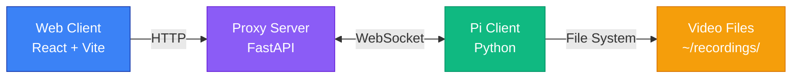

# CAMS Connector - Raspberry Pi Video Browsing System

完整的監視器影片瀏覽系統，透過 WebSocket 隧道讓外部客戶端存取位於 NAT 後的 Raspberry Pi 影片檔案。

Complete camera video browsing system that enables external clients to access video files on a Raspberry Pi behind NAT via WebSocket tunnel.

---

## 📁 專案結構 / Project Structure

```
cams-connector/
├── proxy/              # Proxy Server (FastAPI)
│   ├── main.py        # Main application
│   ├── ws_manager.py  # WebSocket connection manager
│   ├── models.py      # Data models
│   ├── config.py      # Configuration (pydantic-settings)
│   └── pyproject.toml # UV dependencies
├── pi_client/         # Pi Client (Python)
│   ├── main.py        # Entry point
│   ├── client.py      # WebSocket client
│   ├── file_handler.py # File system handler
│   ├── models.py      # Data models
│   ├── config.py      # Configuration (pydantic-settings)
│   └── pyproject.toml # UV dependencies
└── web_client/        # Web Client (React + Vite)
    ├── src/
    │   ├── components/ # UI components
    │   ├── api.ts     # API service
    │   ├── App.tsx    # Main app
    │   └── index.css  # Styling
    └── package.json
```

---

## 🚀 快速開始 / Quick Start

> 💡 **Note**: This project uses [uv](https://github.com/astral-sh/uv) for Python dependency management. Install it first:
> ```bash
> curl -LsSf https://astral.sh/uv/install.sh | sh
> ```

### 1️⃣ Proxy Server

**安裝 / Install:**
```bash
cd proxy
uv sync
```

**設定 / Configure:**
```bash
cp .env.example .env
# 編輯 .env 設定 DEVICE_TOKEN 和 JWT_SECRET
```

**執行 / Run:**
```bash
uv run python main.py
# 或 / or
uv run uvicorn main:app --reload --host 0.0.0.0 --port 8000
```

Server will run on `http://localhost:8000`

---

### 2️⃣ Pi Client (在 Raspberry Pi 上執行 / Run on Raspberry Pi)

**安裝 / Install:**
```bash
cd pi_client
uv sync
```

**設定 / Configure:**
```bash
cp .env.example .env
# 編輯 .env 設定:
# - DEVICE_ID: 監視器 ID (例如 cam1)
# - DEVICE_TOKEN: 與 Proxy 相同的 token
# - PROXY_URL: Proxy WebSocket URL
# - RECORDINGS_DIR: 影片存放目錄
```

**執行 / Run:**
```bash
uv run python main.py
```

**目錄結構 / Directory Structure:**
影片檔案應存放在: `~/recordings/<camera_name>/merged/YYYYmmdd_HH:MM.mp4`

例如:
```
~/recordings/
├── cam1/
│   └── merged/
│       ├── 20231123_14:30.mp4
│       └── 20231123_14:31.mp4
└── cam2/
    └── merged/
        └── 20231123_14:30.mp4
```

---

### 3️⃣ Web Client

**安裝 / Install:**
```bash
cd web_client
npm install
```

**設定 / Configure:**
確保 `.env` 檔案中的 API URL 正確:
```
VITE_API_BASE_URL=http://localhost:8000
```

**執行 / Run:**
```bash
npm run dev
```

Open `http://localhost:5173` in your browser.

---

## **【期望架構】**


## 🏗️ 系統架構 / Architecture

```
┌─────────────┐       HTTP        ┌──────────────┐      WebSocket     ┌─────────────┐
│             │ ────────────────> │              │ <───────────────── │             │
│ Web Client  │                   │ Proxy Server │                    │  Pi Client  │
│  (Browser)  │ <──────────────── │   (FastAPI)  │                    │ (Raspberry) │
└─────────────┘    Video Stream   └──────────────┘                    └─────────────┘
                                          │
                   ┌──────────────────────┼──────────────────────┐
                   │                      │                      │
                   v                      v                      v
            WebSocket Manager      HTTP Endpoints        Authentication
            - Pi connections       - List videos         - Device token
            - Request routing      - Stream video        - JWT (optional)
            - Binary streaming     - Range support
```

### 通訊協議 / Communication Protocol

#### Pi ↔ Proxy (WebSocket)

**Authentication:**
```json
{
  "token": "your-device-token"
}
```

**Request (Proxy → Pi):**
```json
{
  "id": "uuid",
  "type": "LIST_VIDEOS" | "READ_FILE",
  "payload": { ... }
}
```

**Response (Pi → Proxy):**
```json
{
  "id": "uuid",
  "type": "LIST_VIDEOS_RES" | "ERROR",
  "payload": { ... }
}
```

**Binary Data (Pi → Proxy):**
```
[36 bytes: Request ID (UUID)][Remaining: Video Data]
```

#### Client ↔ Proxy (HTTP)

**列出影片 / List Videos:**
```
GET /api/devices/{device_id}/videos
```

**串流影片 / Stream Video:**
```
GET /api/devices/{device_id}/videos/{filename}
```
Supports `Range` header for seeking.

**健康檢查 / Health Check:**
```
GET /health
```

---

## 🎨 功能特色 / Features

- ✅ **穿透 NAT**: Pi 主動連線 Proxy，無需固定 IP
- ✅ **即時串流**: 支援 HTTP Range Requests，可拖曳播放
- ✅ **自動重連**: Pi Client 自動重新連線
- ✅ **影片列表**: 依時間排序顯示影片
- ✅ **現代化 UI**: React + Vite，暗色主題
- ✅ **響應式設計**: 支援手機、平板、電腦

---

## 🔒 安全性 / Security

1. **Device Authentication**: Pi 使用 `DEVICE_TOKEN` 驗證
2. **Environment Variables**: 敏感資訊存在 `.env` 中
3. **CORS**: Proxy 設定允許的來源
4. **Stateless**: Proxy 不儲存影片，僅轉發

> ⚠️ **警告**: 預設配置僅適用於開發環境。生產環境請:
> - 使用 HTTPS/WSS
> - 設定強密碼 token
> - 啟用客戶端 JWT 驗證
> - 設定防火牆規則

---

## 📝 授權 / License

MIT License

---

## 🛠️ 除錯 / Troubleshooting

### Pi Client 無法連線
1. 檢查 Proxy Server 是否執行
2. 檢查 `PROXY_URL` 是否正確
3. 檢查 `DEVICE_TOKEN` 是否一致

### Web Client 無法載入影片
1. 檢查 Proxy Server 是否執行
2. 檢查 Pi Client 是否連線 (查看 `/health` endpoint)
3. 檢查瀏覽器 Console 是否有 CORS 錯誤

### 影片無法拖曳
1. 確認 Proxy 正確處理 Range 請求
2. 確認影片格式正確 (MP4 with moov atom at start)

---

## 📧 聯絡 / Contact

如有問題，請開 Issue 討論。

For questions, please open an issue.
